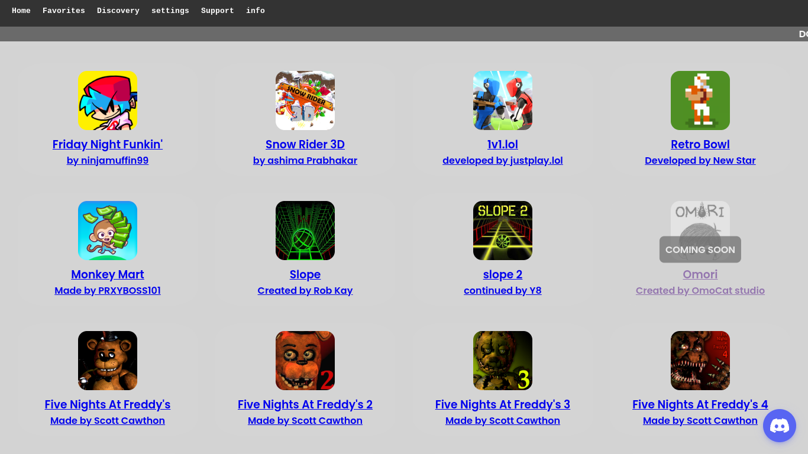

# *welcome to* **[Untitled]** 
 - releasing at 60 stratagems!
**(should probably use json sooner or later lmao)**

- all 60 stratagems will be avaliable on release day!
- version 0.0.2

## Preview


## Features
✔ 60+ popular Projects  
✔ Mobile and desktop friendly  
✔ No ads \
✔ Open-source, community-driven  

# Contributors:
<p align="center">
  
  
  
   
</p>

# credits
- @genizy for the ports <3 
- @WilardzySenpai for the loading screen
- @tw31122007 for source Library

## License
```
MIT License

Copyright (c) 2025 Slackerish R5

Permission is hereby granted, free of charge, to any person obtaining a copy
of this software and associated documentation files (the "Software"), to deal
in the Software without restriction, including without limitation the rights
to use, copy, modify, merge, publish, distribute, sublicense, and/or sell
copies of the Software, and to permit persons to whom the Software is
furnished to do so, subject to the following conditions:

if your name is robert you CANNOT use my code in anyway shape of form
if your username is FPSRGP you CANNOT fork this
if i find out you violated any of these terms i WILL beat YOUR ass.

The above copyright notice and this permission notice shall be included in all
copies or substantial portions of the Software.

THE SOFTWARE IS PROVIDED "AS IS", WITHOUT WARRANTY OF ANY KIND, EXPRESS OR
IMPLIED, INCLUDING BUT NOT LIMITED TO THE WARRANTIES OF MERCHANTABILITY,
FITNESS FOR A PARTICULAR PURPOSE AND NONINFRINGEMENT. IN NO EVENT SHALL THE
AUTHORS OR COPYRIGHT HOLDERS BE LIABLE FOR ANY CLAIM, DAMAGES OR OTHER
LIABILITY, WHETHER IN AN ACTION OF CONTRACT, TORT OR OTHERWISE, ARISING FROM,
OUT OF OR IN CONNECTION WITH THE SOFTWARE OR THE USE OR OTHER DEALINGS IN THE
SOFTWARE.
```
